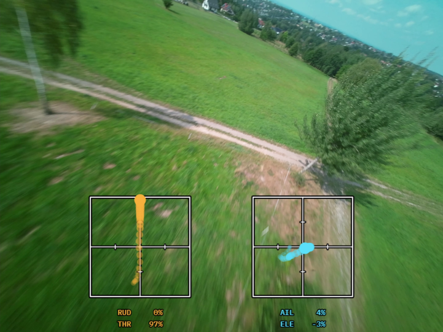
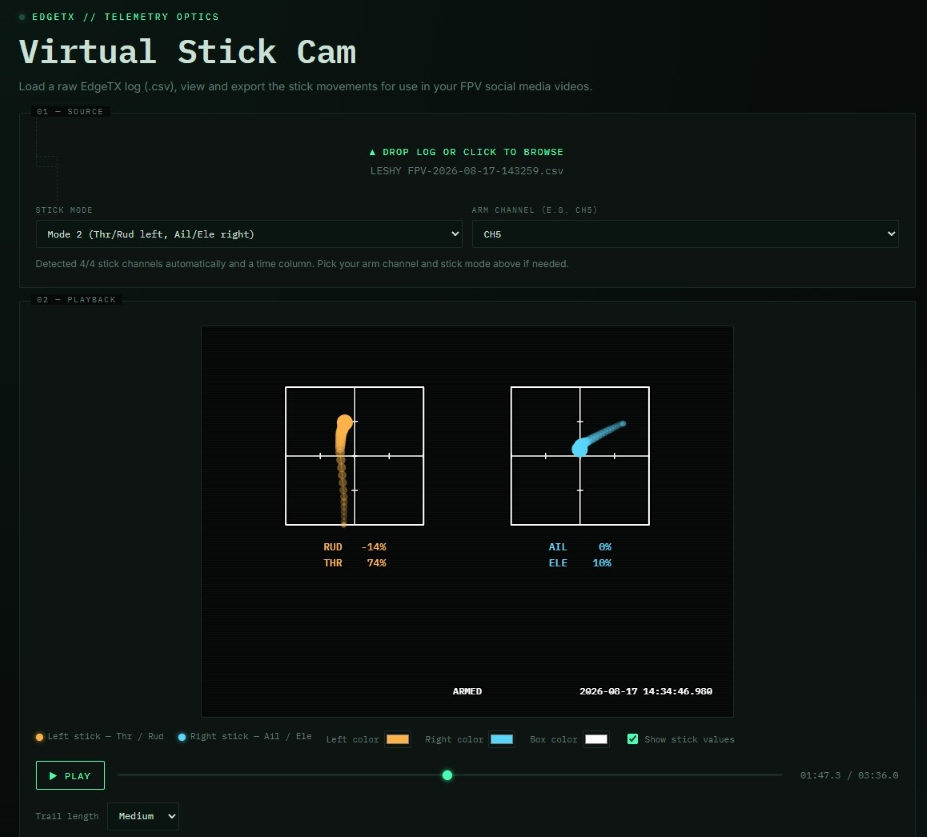
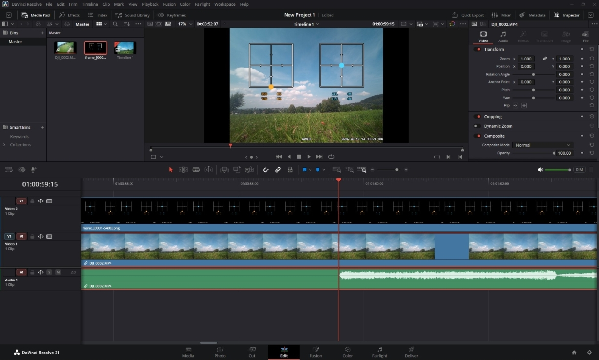

# FPV Virtual Stick Cam

A browser tool that turns an EdgeTX flight log into an animated stick overlay for your FPV videos.
Everything runs locally in your browser. Your logs never leave your machine.

## How to Use:
**[---Watch the instructional video here---](https://www.youtube.com/watch?v=21rkLVZBiMU)**

1. Download and open `virtual-stick-cam.html` in the internet browser of your choice.
2. Open your EdgeTX telemetry file in the app.
3. Tweak the colors and settings if you want, then hit Play to preview.
4. Pick a framerate and format, then click Export. Let the flight play all the way through. Then download the file.
5. Drag and drop the folder of frames (or WebM file) onto your timeline in your video editor. It will recognize it as a video clip.

